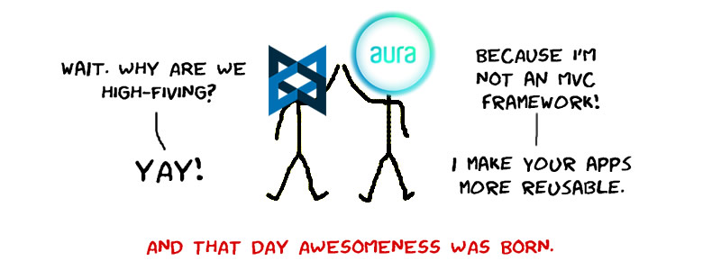
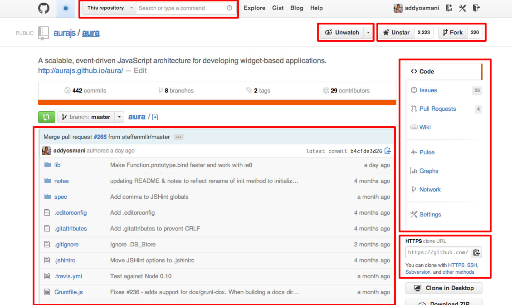
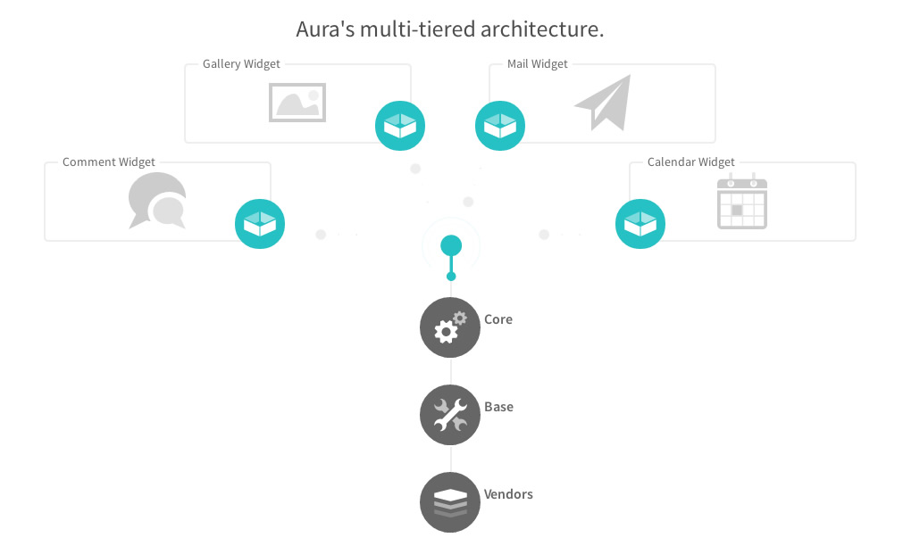

Aura is an **event-driven extensible architecture for wrapping your code into reusable components and extensions that can easily communicate with each other.**
 
We work great with **existing** frameworks like [Backbone.js](http://backbonejs.org) or [Ember](http://emberjs.com), but are framework-agnostic, adapting many best-practice patterns for developing maintainable applications.



Aura has first-class support for modern tools like [Bower](http://bower.io), [Grunt](http://gruntjs.com) and [Yeoman](http://yeoman.io) and uses libraries like [RequireJS](http://requirejs.org/) under the covers (for now). As solutions like ES6 modules and [Polymer](http://www.polymer-project.org) become stable and usable, the project will move towards using them.

## Everything is a component

A component is something **[atomic](http://juristr.com/blog/2013/04/modularity-in-javascript-frameworks/)** with a clear responsibility. A mini-app basically that can be instantiated (possibly multiple times) on an arbitrary part of your application. You might not be accustomed to thinking like this, preferring to build a highly coupled app. That might work just fine initially, but once it gets more complex you can run into trouble. Therefore, next time when you start building something bigger, stop for a moment and try to identify possible components.

Consider for example GitHub’s site:



Separating your application into smaller parts is essential for keeping your architecture clean, reusable and mainly maintainable. The principle is a known concept in computer science: “divide and conquer”. Divide everything up into smaller parts which have lower complexity, are easier to test and cause fewer headaches. Then compose them together to form your larger application.

### But Wait: My Components Have to Communicate!

Aura Components within your application need to communicate with each other. Such communication creates dependencies as component A needs to have a reference to component B if it needs to invoke some operation on it, right? Well, not necessarily, as that would again couple those components together and you couldn’t exchange component B arbitrarily without having to also change component A.

Therefore, a common practice for creating a modular architecture is to decouple communication among components through event broadcasting mechanisms. Aura comes with global and component-level messaging patterns, making this a breeze.



## A Quick Example

### How does it work ?

Components are completely decoupled, they only can talk to each other via events. You can't have a handle on them from the outside, and themselves are just aware of what you explicitely make available throught their `sandboxes`.

To build your app, you can assemble components via AuraJS's HTML API, by using the `data-aura-component` attribute.

Let's take an example. Let's say that we want to build a Github Issues app. We need to be able to :

* Display lists of issues from specific repos
* Filter those issues


Now let's make some components, but first we need a way to talk to [Github's API](http://developer.github.com/v3/issues/).

Here is a simple [AuraJS extension](https://github.com/aurajs/aura/blob/master/notes/extensions.md) that does just that :

**extensions/aura-github.js**

```js
    define({
      initialize: function (app) {
        app.sandbox.github = function (path, verb, data) {
          var dfd = $.Deferred();
          var token = app.config.github.token;
          verb = verb || 'get';
          if (data &amp;&amp; verb != 'get') {
            data = JSON.stringify(data);
          }
          $.ajax({
            type: verb,
            url: 'https://api.github.com/' + path,
            data: data,
            headers: {
              "Authorization": "token " + token
            },
            success: dfd.resolve,
            error: dfd.reject
          });
          return dfd;
        };
      }
    });
```

This extension exposes in all our components a way to talk to Github's API via the `this.sandbox.github` method.

To use it in your aura app :

**app.js**


```js
    var app = new Aura({
      github: { token: 'current-user-token-here' }
    });
    app.use('extensions/aura-github');
    app.start({ components: 'body' });
```

And now, let's write the issues` component :

**components/issues/main.js**


```js
    define(['underscore', 'text!./issues.html'], function(_, tpl) {

      // Allow template to be overriden locally 
      // via a text/template script tag
      var template, customTemplate = $('script[data-aura-template="github/issues"]');
      if (customTemplate.length &gt; 0) {
        template = _.template(customTemplate.html());
      } else {
        template = _.template(tpl);
      }

      return {
        initialize: function() {
          _.bindAll(this);
          this.repo   = this.options.repo;
          this.filter = this.options.filter || {};
          this.sandbox.on('issues.filter', this.fetch, this);
          this.fetch();
        },
        fetch: function(filter) {
          this.filter = _.extend(this.filter, filter || {});
          var path = 'repos/' + this.repo + '/issues';
          return this.sandbox.github(path, 'get', this.filter).then(this.render);
        },
        render: function(issues) {
          this.html(template({
            issues: issues,
            filter: this.filter,
            repo: this.repo
          }));
        }
      };
    });
```

Now we can place this component everywhere in our app by using Aura's HTML API based on data-attributes.


```html
    &lt;div data-aura-component="issues" data-aura-repo="aurajs/aura"&gt;&lt;/div&gt;
```

You can even have multiple instances of this component in you page :


```html
    &lt;div class='row'&gt;
      &lt;div class='span4' data-aura-component="issues" data-aura-repo="aurajs/aura"&gt;&lt;/div&gt;
      &lt;div class='span4' data-aura-component="issues" data-aura-repo="emberjs/ember.js"&gt;&lt;/div&gt;
      &lt;div class='span4' data-aura-component="issues" data-aura-repo="documentcloud/backbone"&gt;&lt;/div&gt;
    &lt;/div&gt;
```

Any other component can now emit `issues.filter`  events that these components will respond to.
For example in another component that will allow the user to filter the issues lists, we can have :

```js
    this.sandbox.emit('issues.filter', { state: 'closed' });
```

You can find a [Github client demo app based on AuraJS + a bunch of Github components here](http://github.com/sbellity/aura-github)

## Why Aura?

Web apps are all about the end user experience (UI, DOM elements). The web development ecosystem is all about much more low level stuff. We need a way to package higher level abstractions and make them truly reusable, and that's what Aura is all about.

Need some more reasons to use Aura?:

* It's basically **glue** for your application components, making it trivial to tie together a number of independently created components into a fully functional application.
* A complete event-bus supporting **application-level and component-level communication** mean you have control over what is getting triggered in your app
* Specify an API end-point for components easily and just **use data-attributes to include any component** or components. Minimal JavaScript for more capabilities.
* **Abstract away utility libraries** you are using (templating, DOM manipulation) so that you can swap them out for alternatives at any time without a great deal of effort
* Hit the ground running quickly components into **reusable modules using AMD**.
* Bower is a first-class citizen in Aura, making it easier to **manage your application dependencies**
* The web platform is moving towards using scoped styles and shadow DOM for keeping parts of your page safe from third-party content that might affect it. Aura does the same for communications by introducing per-component **sandboxes** for your events
* Tooling for **scaffolding** out new components without having to write as much boilerplate
* Can be used with your MVC framework of choice - we're just there as a helper.
* First-class support for the Hull.io platform. If you don't want to create a component yourself, you can easily use them as a component-source and create apps in less time.
* Extensible via the extensions system, which make a good basis for a rich ecosystem around the project.

## FAQs

* [Where does Aura fit in the MVC workflow?](https://github.com/aurajs/aura/issues/223)
* [How do you initialize a component with with data objects?](https://github.com/aurajs/aura/issues/222)
* [Using multiple views and models in a component](https://github.com/aurajs/aura/issues/224)
* [Sharing collections of data](https://github.com/karlwestin/aura-example)


### Why do developers use us?

* "The architecture and the fact that Aura Components are completely decoupled, will allow us to build an ecosystem of components that people can reuse internally or share with others."
* "With ComponentSources and Require, we can load only the components that are needed by the app... at runtime."
* "No JS is required to wire everything up, just include components with data-attributes in their markup"
* "Mediation, same thing here it's a prerequisite to make everything decoupled... but in addition, it allows us to write much less code..."
* "Template overrides FTW"

# Contribute

We are more than happy to accept external contributions to the project in the form of feedback, bug reports and even better - pull requests :) At this time we are primarily focusing on improving the stability of AuraJS. Please keep this in mind if submitting feature requests, which we're happy to consider for future versions.

### Issue submission

In order for us to help you please check that you've completed the following steps:

* Made sure you're on the latest version in master
* Used the search feature to ensure that the bug hasn't been reported before
* Included as much information about the bug as possible, including any output you've received, what OS and version you're on, etc.
* If making a bug report, please post a test case reproducing your issue on jsFiddle.net or jsBin. We will do our best to assist if this is not possible, but please understand this would greatly help improve or ability to help.

[Submit your issue](https://github.com/aurajs/aura/issues/new)

### Pull Request Guidelines

* Please check to make sure that there aren't existing pull requests attempting to address the issue mentioned. We also recommend checking for issues related to the issue on the tracker, as a team member may be working on the issue in a branch or fork.
* Non-trivial changes should be discussed in an issue first
* Develop in a topic branch, not master
* Add relevant tests to cover the change
* Squash your commits
* Write a convincing description of your PR and why we should land it